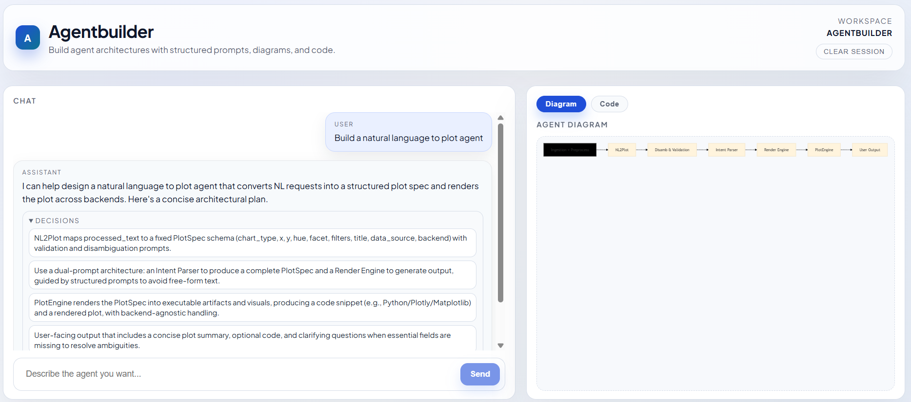

# Agentbuilder (CLI) [WIP]

Agentbuilder is a terminal-only, natural-language agent builder. You describe an agent, Agentbuilder generates a TypeScript agent project, builds it, and lets you run it as an interactive chatbot in your terminal.



## Requirements
- Node.js 18+
- `OPENAI_API_KEY` in your environment

## Install
```bash
npm install
npm run build
chmod +x ./agentbuilder
```

## Usage
```bash
./agentbuilder chat
./agentbuilder list
./agentbuilder run <agent-name> --task "your task"
./agentbuilder config
```

## How It Works
- Agents are stored in `~/.agentbuilder/agents/<name>`.
- Each agent is a TypeScript project with its own `package.json` and `src/index.ts`.
- On first run, Agentbuilder installs dependencies and compiles the agent.
- The `run` command launches the agent as a persistent REPL in the current terminal.
- Use `--terminal` to open the agent in a new terminal window.

## Notes
- Add `~/.agentbuilder/bin` to your `PATH` if you want to call agents directly.
- Agents default to a conversational REPL when no `--task` is provided.
- Press `Ctrl+O` during streaming to toggle internal chatter on/off.
- Use `./agentbuilder chat --multiline` if you want to enter a multi-line agent prompt.
- Configure Tavily (web search) with `./agentbuilder config` (keys stored locally in `~/.agentbuilder/keys.json`).
- Legacy web app files remain in `frontend/` and `backend/` and are not used by the CLI.
- All generated agents use the `gpt-5-nano-2025-08-07` model.

## ReAct Agents + Tools
Generated agents use a ReAct-style loop with built-in tools:
- `web_search` (Tavily)
- `fetch_url`
- `list_files`
- `read_file`
- `write_file`

Tools never receive your API keys; keys stay local on disk or in environment variables.
